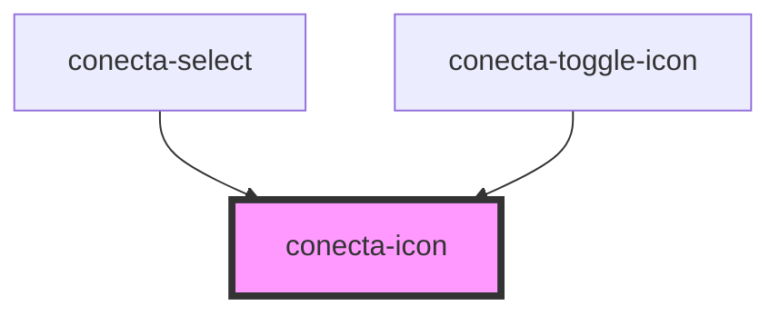

# conecta-icon

<!-- Auto Generated Below -->

## Properties

| Property  | Attribute | Description             | Type                                                                                                      | Default          |
| --------- | --------- | ----------------------- | --------------------------------------------------------------------------------------------------------- | ---------------- |
| `name`    | `name`    | Nome do ícone do Lucide | `string`                                                                                                  | `undefined`      |
| `size`    | `size`    | Tamanho do ícone        | `"large" \| "medium" \| "small" \| "xlarge"`                                                              | `'medium'`       |
| `variant` | `variant` | Variante do ícone       | `"currentColor" \| "danger" \| "info" \| "neutral" \| "primary" \| "secondary" \| "success" \| "warning"` | `'currentColor'` |

## Dependencies

### Used by

 - [conecta-select](../conecta-select)
 - [conecta-toggle-icon](../conecta-toggle-icon)

### Graph

----------------------------------------------

*Built with [StencilJS](https://stenciljs.com/)*
