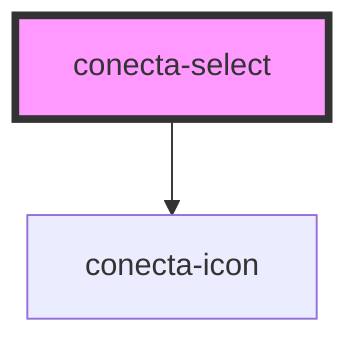

# conecta-select

<!-- Auto Generated Below -->

## Properties

| Property       | Attribute       | Description                                                                      | Type                                            | Default                               |
| -------------- | --------------- | -------------------------------------------------------------------------------- | ----------------------------------------------- | ------------------------------------- |
| `disabled`     | `disabled`      | Se está desabilitado                                                             | `boolean`                                       | `false`                               |
| `error`        | `error`         | Estado de erro                                                                   | `boolean`                                       | `false`                               |
| `errorMessage` | `error-message` | Mensagem de erro                                                                 | `string`                                        | `''`                                  |
| `helpText`     | `help-text`     | Mensagem de ajuda                                                                | `string`                                        | `''`                                  |
| `label`        | `label`         | Label do select                                                                  | `string`                                        | `''`                                  |
| `name`         | `name`          | Nome do campo para formulários                                                   | `string`                                        | `''`                                  |
| `options`      | `options`       | Lista de opções. Pode ser atribuída via propriedade (Array) ou string JSON.      | `string \| { label: string; value: string; }[]` | `[]`                                  |
| `placeholder`  | `placeholder`   | Placeholder exibido como opção desabilitada quando nenhum valor está selecionado | `string`                                        | `''`                                  |
| `required`     | `required`      | Se é obrigatório                                                                 | `boolean`                                       | `false`                               |
| `selectId`     | `select-id`     | ID do select                                                                     | `string`                                        | `` `conecta-select-${selectIds++}` `` |
| `size`         | `size`          | Tamanho do componente                                                            | `"large" \| "medium" \| "small"`                | `'medium'`                            |
| `value`        | `value`         | Valor selecionado                                                                | `string`                                        | `''`                                  |

## Events

| Event          | Description                         | Type                      |
| -------------- | ----------------------------------- | ------------------------- |
| `selectBlur`   | Emitido quando o select perde foco  | `CustomEvent<FocusEvent>` |
| `selectChange` | Emitido quando o valor muda         | `CustomEvent<string>`     |
| `selectFocus`  | Emitido quando o select recebe foco | `CustomEvent<FocusEvent>` |

## Dependencies

### Depends on

- [conecta-icon](../conecta-icon)

### Graph

----------------------------------------------

*Built with [StencilJS](https://stenciljs.com/)*
