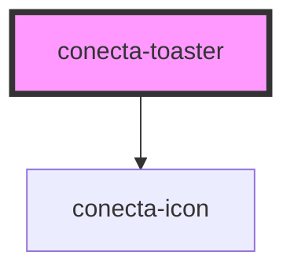

# conecta-toaster

<!-- Auto Generated Below -->

## Properties

| Property    | Attribute    | Description                         | Type                                                                                              | Default       |
| ----------- | ------------ | ----------------------------------- | ------------------------------------------------------------------------------------------------- | ------------- |
| `maxToasts` | `max-toasts` | Número máximo de toasts simultâneos | `number`                                                                                          | `5`           |
| `position`  | `position`   | Posição do toaster na tela          | `"bottom-center" \| "bottom-left" \| "bottom-right" \| "top-center" \| "top-left" \| "top-right"` | `'top-right'` |
| `zIndex`    | `z-index`    | Z-index do container                | `number`                                                                                          | `9999`        |

## Methods

### `addToast(toast: Omit<Toast, "id" | "timestamp">) => Promise<string>`

Adiciona um toast ao toaster

#### Parameters

| Name    | Type                                                                                                                                                        | Description |
| ------- | ----------------------------------------------------------------------------------------------------------------------------------------------------------- | ----------- |
| `toast` | `{ message: string; variant: "primary" \| "secondary" \| "danger" \| "success" \| "warning" \| "info" \| "neutral"; duration: number; closable: boolean; }` |             |

#### Returns

Type: `Promise<string>`

### `clearAll() => Promise<void>`

Limpa todos os toasts

#### Returns

Type: `Promise<void>`

### `removeToast(id: string) => Promise<void>`

Remove um toast pelo ID

#### Parameters

| Name | Type     | Description |
| ---- | -------- | ----------- |
| `id` | `string` |             |

#### Returns

Type: `Promise<void>`

## Dependencies

### Depends on

- [conecta-icon](../conecta-icon)

### Graph

----------------------------------------------

*Built with [StencilJS](https://stenciljs.com/)*
