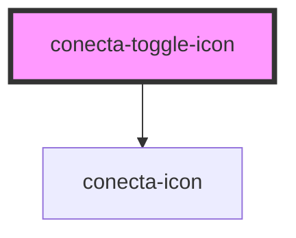

# conecta-toggle-icon

<!-- Auto Generated Below -->

## Properties

| Property   | Attribute  | Description                                        | Type                                                                                    | Default     |
| ---------- | ---------- | -------------------------------------------------- | --------------------------------------------------------------------------------------- | ----------- |
| `active`   | `active`   | Estado ativo do toggle                             | `boolean`                                                                               | `false`     |
| `disabled` | `disabled` | Se o toggle está desabilitado                      | `boolean`                                                                               | `false`     |
| `name`     | `name`     | Nome do ícone do Lucide                            | `string`                                                                                | `undefined` |
| `readonly` | `readonly` | Se o toggle é somente leitura (não alterna estado) | `boolean`                                                                               | `false`     |
| `size`     | `size`     | Tamanho do toggle                                  | `"large" \| "medium" \| "small"`                                                        | `'medium'`  |
| `variant`  | `variant`  | Variante quando ativo                              | `"danger" \| "info" \| "neutral" \| "primary" \| "secondary" \| "success" \| "warning"` | `'primary'` |

## Events

| Event          | Description                                   | Type                   |
| -------------- | --------------------------------------------- | ---------------------- |
| `toggleChange` | Evento emitido quando o estado do toggle muda | `CustomEvent<boolean>` |

## Dependencies

### Depends on

- [conecta-icon](../conecta-icon)

### Graph

----------------------------------------------

*Built with [StencilJS](https://stenciljs.com/)*
